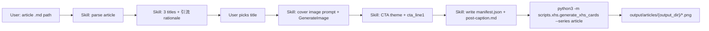

# Xiaohongshu article card generator (Skill + script)

**Date:** 2026-06-27  
**Status:** Approved  
**Goal:** From a Hugo `content/docs/` article, produce a Xiaohongshu-ready image series (cover + verbatim body slides + follow CTA slide) via a **repo-committed Cursor Skill** and a **Python render script**.

## Problem

Articles are currently copy-pasted into Xiaohongshu as plain text. Engagement is low. Aside from content quality, the presentation lacks:

- A click-worthy cover and marketing title
- Consistent, fresh multi-slide layout (1080×1440)
- A platform-native closing slide that encourages **follow on Xiaohongshu only** (no WeChat引流 — XHS penalizes external links)

The repo already has `scripts/xhs/` with Playwright HTML→PNG rendering and a warm typography design system (`base.css`, 1080×1440). That pipeline serves **reading inventory infographics**, not single-article slides.

## Repo constraint (must fix during implementation)

Today `.gitignore` ignores the **entire** `scripts/xhs/` tree, and none of it is tracked in git. That conflicts with shipping the article renderer and using it on a second machine.

**Implementation step 0:** change `.gitignore` to ignore only generated artifacts:

```gitignore
# Xiaohongshu generated output (local)
scripts/xhs/output/
```

Then **commit** (at minimum):

- `scripts/xhs/` Python package (`generate_xhs_cards.py`, `xhs_cards/`, `config.yml`, `tests/`)
- `scripts/xhs/data/reading_inventory.json` (existing series-a input; already in workspace)
- `.cursor/skills/xhs-article-cards/`

Keep **`scripts/xhs/output/`** gitignored.

## Decisions (confirmed)

| Topic | Decision |
|-------|----------|
| XHS title | **3 candidates** with rationale; user picks one before render |
| Cover | **AI background** (Cursor `GenerateImage`) + **script typography overlay** |
| Body slides | **Verbatim** article text; strip Hugo「原文链接，更新于…」footer only |
| Closing slide | Extra page; **follow XHS only**, no公众号 |
| CTA theme | Two directions: **读书感悟** / **生活分享**, mapped from `primary_category` (Skill may override) |
| CTA copy | **One article-specific共鸣句** (`cta_line1`); fixed @nickname + bio on end slide |
| Interaction | **Full Cursor workflow**: user points at `.md`, Skill orchestrates end-to-end |
| Re-render | **`manifest.json`** on disk; script supports `--rerender` without re-running LLM |
| Skill location | **Committed in this repo** (`.cursor/skills/`) for use on a second machine |

## Principles

1. **Skill for judgment, script for determinism** — titles, cover prompt, CTA copy, hashtags: Skill (LLM). Pagination, HTML, PNG: Python + Playwright.
2. **Verbatim body** — no summarization on content slides; only pagination and styling.
3. **Platform-safe引流** — no WeChat links on slides or suggested post caption.
4. **Reuse existing visual system** — extend `base.css`; same viewport and `@我要改名叫嘟嘟` footer pattern as series-a.
5. **Repo-portable** — Skill + script + config tracked in git; generated PNGs under `scripts/xhs/output/` (gitignored).

## Prerequisites

From repo root on any machine:

```bash
python3 -m venv .venv && source .venv/bin/activate
pip install -r scripts/requirements.txt
playwright install chromium
```

Open the repo in Cursor. Invoke the skill explicitly (see Skill metadata below).

## Architecture



### Components

| Component | Path | Role |
|-----------|------|------|
| Cursor Skill | `.cursor/skills/xhs-article-cards/SKILL.md` | Orchestration, LLM steps, user gates |
| Render CLI | `scripts/xhs/generate_xhs_cards.py` | Add `--series article`, `--manifest`, `--rerender` |
| Article module | `scripts/xhs/xhs_cards/article.py` | Parse md, paginate, render HTML slides |
| Styles | `scripts/xhs/xhs_cards/article.css` | Body + cover overlay + end slide (extends `base.css`) |
| Config | `scripts/xhs/config.yml` | nickname, bio, chars-per-slide, CTA category mapping |
| Category titles | `data/categories.yml` | Optional context for CTA theme; **not** shown on body slide header |
| Manifest | `scripts/xhs/output/articles/{output_dir}/manifest.json` | Single source of truth for one generation run |
| Tests | `scripts/xhs/tests/test_article_*.py` | Paginator + HTML snapshot (no Playwright in CI) |

## Skill workflow

**Trigger phrases:** 「生成小红书图」「xhs cards」「把这篇生成小红书图」+ path to `content/docs/.../*.md`.

**Skill metadata** (in `SKILL.md` frontmatter):

- `name: xhs-article-cards`
- `description:` generate Xiaohongshu slide images from a Hugo article path
- `disable-model-invocation: true` — only run when user explicitly asks

### Step 1 — Read article

- Parse YAML frontmatter: `title`, `date`, `primary_category`, optional `source_url`
- Resolve `cta_theme` from `primary_category` (category label from `data/categories.yml` is optional context only — **not** rendered on slides)
- Read body; strip trailing inline footer using the same patterns as `scripts/wechat/normalize_article_footer.py` (`<small>（<a …>原文链接</a>…）</small>`, promo `↓↓↓` lines, `article-follow-cta` divs)
- **v1 text-only:** if body contains `<figure>` or `

Output **3 candidates**. Each includes:

1. **Title text** (XHS note title; may differ from `title` in frontmatter)
2. **Why it attracts clicks** — 2–3 sentences: hook type (curiosity, contrast, specificity, emotion), target reader, scroll-stop reason
3. **Relation to original title** — one line

Wait for user to pick (e.g.「用第 2 个」). Do not proceed without an explicit choice.

### Step 3 — Cover background

- Skill writes an image prompt: fresh, soft, reading/life mood matching article; **no readable text in image**; leave negative space for title overlay (upper half)
- Call `GenerateImage`; move/copy the result into the output dir as `cover-ai.png` (must exist before Step 5; re-use this file on `--rerender`)

### Step 4 — CTA theme and copy

**Theme selection (`cta_theme`):**

| Value | Display label | Default categories (see config) |
|-------|---------------|----------------------------------|
| `reading` | 读书感悟 | reading-category, reading, book-quotes-sharing, zimbardo-general-psychology, summary |
| `life` | 生活分享 | life-diary, subway-diary, 30min-diary, learning-to-cook, marriage, intimate-relationships, shenzhen, workplace-experience, technical-blog |

- Default from `primary_category` via `scripts/xhs/config.yml`
- Skill may override when article content clearly fits the other theme

**Closing slide copy (article-specific):**

| Field | Purpose | Rules |
|-------|---------|-------|
| **`cta_line1` — 共鸣句** | Echo a feeling, question, or insight from *this* post | May paraphrase; must reference concrete details (book, scene, emotion). No generic「如果这篇对你有启发」. Do not hint at following/subscribing. |

**Fixed on end slide (always rendered by script):**

- `@我要改名叫嘟嘟`
- `一个用文字分享生活和读书感悟的程序员`

**Example (读书感悟 — see `examples.md` for full walk-through):**

- `cta_line1`: 「读完《特斯拉自传》，我对《外星人访谈录》里『现在-成为者』的着迷，祛魅不少。」

**Example (生活分享 / subway-diary):**

- `cta_line1`: 「今天地铁上又发生了一件小事，不写下来明天可能就忘了。」

### Step 5 — Write manifest and render

1. Compute `{output_dir}` = hyphenated pinyin of `original_title` via `resolve_article_output_dir()` (on title collision across different sources, append post id suffix)
2. Create `scripts/xhs/output/articles/{output_dir}/`
3. Write `manifest.json` (schema below)
4. Run from repo root:

```bash
python3 -m scripts.xhs.generate_xhs_cards \
  --series article \
  --manifest scripts/xhs/output/articles/<output_dir>/manifest.json
```

**`--rerender`:** re-read `manifest.json` and `source` article; regenerate PNGs only. Do not call `GenerateImage`. Fail if `cover-ai.png` is missing in the manifest directory (legacy `cover-bg.png` is still accepted as input).

### Step 6 — Deliverables

Skill writes `post-caption.md` in the output dir:

```markdown
# 小红书标题
{chosen xhs_title}

# 正文说明（可直接粘贴）
{1–2 sentence hook, no external links}

# 话题标签
#读书 #读书笔记 …
```

Print to user:

- Output directory and ordered file list
- Path to `post-caption.md`
- Reminder: upload images **in filename order**; use chosen title as note title

## Body slide rules

- **Verbatim** paragraphs and blockquotes after footer strip
- **Pagination:** height-estimated greedy fill with book-style sentence flow (`article_paginator.py`). Original markdown paragraph boundaries are preserved via `source_id` — do not merge distinct paragraphs on one slide.
- **Long paragraph / quote:** split at sentence boundaries (paren-aware); `chars_per_slide` in manifest only triggers hard-split of a single oversized block (default **340**)
- **Last body slide** may be sparse; do not peel content from earlier slides just to fill it
- **Slide header (body pages):** `xhs_title` from manifest (not category chip)
- **Footer on body slides only:** `{page}/{body_total}` right-aligned; **no** `@nickname` watermark. Cover and end have **no** slide footer.
- **No** WeChat URLs or「原文链接」on any slide

### Overflow safety

`article_overflow.py` runs Playwright on each body slide HTML before PNG export:

1. If `.slide-body` does not overflow → no change
2. If overflow → peel trailing sentence/block to the next slide (minimal fix)
3. Re-merge adjacent blocks with the same `source_id` on each page (one quote box per source quote)

Manual QA still recommended on the first article in a new environment: confirm no text clips the bottom border and quotes on the same slide are not visually split.

If systematic clipping persists across articles, adjust `article_layout.py` constants to match `article.css`, not `chars_per_slide`.

## Slide sequence and naming

| Order | Filename | Content | Slide footer |
|-------|----------|---------|--------------|
| 1 | `01-cover.png` | AI `cover-ai.png` + overlay: `xhs_title` only | none |
| 2 … N−1 | `02.png`, `03.png`, … | Body pages (zero-padded) | `{1}/{body}` … `{body}/{body}` |
| N | `{NN}-end.png` | `cta_line1` + @nickname + bio (in card body) | none |

**Cover overlay fields** (from manifest):

- `xhs_title` — main large title (Songti on frosted card)
- Input image: `cover-ai.png` (manifest field `cover_ai`); `cover-bg.png` is auto-synced output copy of `01-cover.png`

## Manifest schema

```json
{
  "manifest_version": 1,
  "source": "content/docs/2026/06/reading-category__post-13f67e2873.md",
  "output_dir": "te-si-la-yu-wai-xing-ren",
  "source_slug": "reading-category__post-13f67e2873",
  "original_title": "特斯拉与外星人",
  "xhs_title": "读《特斯拉自传》后，我对外星人祛魅了",
  "primary_category": "reading-category",
  "cover_ai": "cover-ai.png",
  "cta_theme": "reading",
  "cta_line1": "……",
  "nickname": "我要改名叫嘟嘟",
  "bio": "一个用文字分享生活和读书感悟的程序员",
  "chars_per_slide": 340
}
```

- Paths (`source`) are **repo-relative**; `cover_ai` is **manifest-dir-relative**
- Script resolves repo root from `scripts/xhs/` (e.g. `Path(__file__).resolve().parents[2]`) and joins `source`
- `nickname`, `bio`, and `chars_per_slide` in manifest **override** `config.yml`; omit them to use config defaults
- Do **not** set `cover_subtitle`, `category_title`, or `cta_line2` — unused by current renderer
- Body slide header uses **`xhs_title`**, not category label from `data/categories.yml`

## Config (`scripts/xhs/config.yml`)

```yaml
nickname: 我要改名叫嘟嘟
bio: 一个用文字分享生活和读书感悟的程序员
chars_per_slide: 340
default_cta: reading
cta_mapping:
  reading:
    - reading-category
    - reading
    - book-quotes-sharing
    - zimbardo-general-psychology
    - summary
  life:
    - life-diary
    - subway-diary
    - 30min-diary
    - learning-to-cook
    - marriage
    - intimate-relationships
    - shenzhen
    - workplace-experience
    - technical-blog
```

Unlisted `primary_category` values fall back to `default_cta`. Skill may set `cta_theme` in manifest regardless.

## Output layout

Canonical new-article layout (pinyin folder name):

```
scripts/xhs/output/articles/te-si-la-yu-wai-xing-ren/
  manifest.json
  cover-ai.png          # AI input (Skill writes before render)
  cover-bg.png          # auto-synced copy of 01-cover.png after render
  post-caption.md
  01-cover.png
  02.png …              # body slides (count varies by article)
  {NN}-end.png
```

Folder name = hyphenated **pinyin of `original_title`** (not the Hugo filename). On title collision across different sources, append post id: `te-si-la-yu-wai-xing-ren-13f67e2873`.

Legacy runs may use the markdown filename stem as the folder name (e.g. `reading-category__post-13f67e2873/`); the renderer only requires `manifest.json` to live in the output directory — it does not enforce the folder naming convention.

`scripts/xhs/output/` remains gitignored.

## Skill repo layout (committed)

```
.cursor/skills/xhs-article-cards/
  SKILL.md              # triggers, steps, manifest fields, CTA rules, CLI commands
  examples.md           # walk-through with Tesla article (recommended)
```

Cursor loads project skills from `.cursor/skills/` when the repo is opened. On a second machine: clone, open repo in Cursor, invoke by name or trigger phrase.

## Error handling

| Condition | Behavior |
|-----------|----------|
| Missing article path | Skill stops with clear error |
| User has not picked title | Do not render |
| `cover-ai.png` missing at render time | Script error with path |
| Playwright / browser missing | Script exits with `playwright install chromium` hint |
| Body empty after strip | Skill stops |
| `--rerender` without manifest | Script error |
| Unknown `primary_category` slug | Fall back to `default_cta` in config |

## Testing

- `test_article_parser.py` — frontmatter, footer strip, blockquote blocks, `source_id`
- `test_article_paginator.py` — height pagination, paragraph boundaries, quote merge, sparse tail
- `test_article_render.py` — HTML contains expected chunks; cover/end slide markers
- `article_overflow.py` — Playwright overflow peel (integration via full render)

Run: `python3 -m pytest scripts/xhs/tests/ -q` from repo root (with venv).

Manual QA: run Skill on any long article (see `examples.md` for a sample path) — verify no clipped text at slide bottom border and quotes on the same slide are not visually split. Page count varies by article length.

## Out of scope (v1)

- Auto-posting to Xiaohongshu
- 公众号 QR codes or links on slides or in `post-caption.md`
- Embedding WeChat article images in body slides
- Multiple visual themes per category
- AI-generated body slide backgrounds
- Batch processing many articles in one command
- Dynamic font scaling per slide

## Implementation order

0. Fix `.gitignore`; commit existing `scripts/xhs/` sources + `data/`
1. `config.yml` + category mapping helpers (read `data/categories.yml`)
2. `article.py` — parser (footer strip: reuse or share regex from `normalize_article_footer`), paginator, HTML render
3. Extend `generate_xhs_cards.py` — add `--series article` alongside existing `a` / `6years` (unchanged)
4. Tests
5. `.cursor/skills/xhs-article-cards/SKILL.md` (+ `examples.md`)
6. Manual run on a sample article (`examples.md`); iterate `article.css` if needed

## Self-review checklist

- [x] No TBD sections
- [x] `.gitignore` conflict documented with fix (step 0)
- [x] Skill committed in repo (`.cursor/skills/`)
- [x] CTA: one article-specific `cta_line1` + fixed @nickname/bio
- [x] No公众号引流 on slides or caption
- [x] Manifest fields complete (cover_ai, output_dir, chars override)
- [x] Slide header, page numbering, filename convention explicit
- [x] `--rerender` behavior defined
- [x] Prerequisites (venv, playwright) documented
- [x] v1 limits (no inline images) stated
- [x] All `data/categories.yml` slugs mapped in `cta_mapping`
