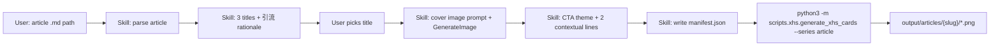

# Xiaohongshu article card generator (Skill + script)

**Date:** 2026-06-27  
**Status:** Approved (user review pending)  
**Goal:** From a Hugo `content/docs/` article, produce a Xiaohongshu-ready image series (cover + verbatim body slides + follow CTA slide) via a **repo-committed Cursor Skill** and a **Python render script**.

## Problem

Articles are currently copy-pasted into Xiaohongshu as plain text. Engagement is low. Aside from content quality, the presentation lacks:

- A click-worthy cover and marketing title
- Consistent, fresh multi-slide layout (1080×1440)
- A platform-native closing slide that encourages **follow on Xiaohongshu only** (no WeChat引流 — XHS penalizes external links)

The repo already has `scripts/xhs/` with Playwright HTML→PNG rendering and a warm typography design system (`base.css`, 1080×1440). That pipeline serves **reading inventory infographics**, not single-article slides.

## Decisions (confirmed)

| Topic | Decision |
|-------|----------|
| XHS title | **3 candidates** with rationale; user picks one before render |
| Cover | **AI background** (Cursor `GenerateImage`) + **script typography overlay** |
| Body slides | **Verbatim** article text; strip Hugo「原文链接，更新于…」footer only |
| Closing slide | Extra page; **follow XHS only**, no公众号 |
| CTA theme | Two directions: **读书感悟** / **生活分享**, mapped from `primary_category` (Skill may override) |
| Interaction | **Full Cursor workflow (A)**: user points at `.md`, Skill orchestrates end-to-end |
| Re-render | **`manifest.json`** on disk; script supports `--rerender` without re-running LLM |
| Skill location | **Committed in this repo** (`.cursor/skills/`) for use on a second machine |

## Principles

1. **Skill for judgment, script for determinism** — titles, cover prompt, CTA copy, hashtags: Skill (LLM). Pagination, HTML, PNG: Python + Playwright.
2. **Verbatim body** — no summarization on content slides; only pagination and styling.
3. **Platform-safe引流** — no WeChat links on slides or suggested post caption.
4. **Reuse existing visual system** — extend `base.css`; same viewport and `@我要改名叫嘟嘟` footer pattern as series-a.
5. **Repo-portable** — Skill + script + config live in git; outputs stay under `scripts/xhs/output/` (gitignored).

## Architecture



### Components

| Component | Path | Role |
|-----------|------|------|
| Cursor Skill | `.cursor/skills/xhs-article-cards/SKILL.md` | Orchestration, LLM steps, user gates |
| Render CLI | `scripts/xhs/generate_xhs_cards.py` | Add `--series article`, `--manifest`, `--rerender` |
| Article module | `scripts/xhs/xhs_cards/article.py` | Parse md, paginate, render HTML slides |
| Styles | `scripts/xhs/xhs_cards/article.css` | Body + cover overlay + end slide (extends base.css) |
| Config | `scripts/xhs/config.yml` | nickname, bio, category→CTA mapping, chars-per-slide |
| Manifest | `scripts/xhs/output/articles/{slug}/manifest.json` | Single source of truth for one generation run |
| Tests | `scripts/xhs/tests/test_article_*.py` | Paginator + HTML snapshot (no Playwright in CI) |

## Skill workflow

**Trigger phrases:** 「生成小红书图」「xhs cards」「把这篇生成小红书图」+ path to `content/docs/.../*.md`.

### Step 1 — Read article

- Parse YAML frontmatter: `title`, `date`, `primary_category`, optional `source_url`
- Read body; remove trailing「原文链接」HTML block (same pattern as `normalize_article_footer`)

### Step 2 — Title candidates (user gate)

Output **3 candidates**. Each includes:

1. **Title text** (XHS note title; may differ from `title` in frontmatter)
2. **Why it attracts clicks** — 2–3 sentences: hook type (curiosity, contrast, specificity, emotion), target reader, scroll-stop reason
3. **Relation to original title** — one line

Wait for user to pick (e.g.「用第 2 个」).

### Step 3 — Cover background

- Skill writes an image prompt: fresh, soft, reading/life mood matching article; **no long text in image**; leave visual space for title overlay (top/center)
- Call `GenerateImage`; save as `{output_dir}/cover-bg.png`

### Step 4 — CTA theme and copy

**Theme selection:**

- Default from `primary_category` via `config.yml` → `reading` or `life`
- Skill may override if article is clearly the other theme

**Closing slide copy (article-specific, not template slogans):**

The Skill generates **two sentences** grounded in the article:

| Line | Purpose | Rules |
|------|---------|-------|
| **Line 1 — 共鸣句** | Echo a feeling, question, or insight from *this* post | May paraphrase the article; must feel specific (book name, scene, emotion). No generic「如果这篇对你有启发」. |
| **Line 2 — 关注理由** | Natural bridge to following | Explain what *similar* content the reader gets next; tie to reading or life theme. Soft CTA; avoid dry「关注我，持续分享…」alone. |

**Fixed elements on end slide (never LLM-only):**

- `@我要改名叫嘟嘟`
- `一个用文字分享生活和读书感悟的程序员`

**Examples (读书感悟 / Tesla article):**

- Line 1: 「读完《特斯拉自传》，我对《外星人访谈录》里『现在-成为者』的着迷，祛魅不少。」
- Line 2: 「如果你也容易被『厉害到不像人』的故事吸住，我会继续把读书时的惊讶和笔记写下来。」

**Examples (生活分享 / subway-diary):**

- Line 1: 「今天地铁上又发生了一件小事，不写下来明天可能就忘了。」
- Line 2: 「我喜欢把这些真实的日常片段留住——如果你也想看一个程序员的生活切面，欢迎留下来。」

Skill writes chosen title, cover path, `cta_theme`, `cta_line1`, `cta_line2` into `manifest.json`.

### Step 5 — Render

From repo root:

```bash
python3 -m scripts.xhs.generate_xhs_cards \
  --series article \
  --manifest scripts/xhs/output/articles/<slug>/manifest.json
```

Re-render after CSS tweaks:

```bash
python3 -m scripts.xhs.generate_xhs_cards \
  --series article \
  --manifest scripts/xhs/output/articles/<slug>/manifest.json \
  --rerender
```

### Step 6 — Deliverables

Print:

- Output directory and file list (`01-cover.png` … `NN-end.png`)
- Suggested XHS caption: chosen title + 3–5 hashtags (no external links)
- Reminder: upload images in order; caption uses chosen title

## Body slide rules

- **Verbatim** paragraphs and blockquotes from source (after stripping 原文链接 footer)
- **Pagination:** split at paragraph boundaries; target ~180–220 Chinese chars per slide (configurable)
- Blockquotes (`>`) use dedicated quote styling; keep block intact when possible
- **Footer on every slide:** `@我要改名叫嘟嘟` + `{page}/{total}` (total includes cover + end)
- **No** WeChat URLs or「原文链接」on any slide

## Slide sequence

| File | Content |
|------|---------|
| `01-cover.png` | AI `cover-bg.png` + overlay: chosen XHS title, optional subtitle (original title or hook), category chip |
| `02.png` … `{N-1}.png` | Body pages |
| `{N}-end.png` | CTA: Line 1, Line 2, @nickname, bio |

## Manifest schema

```json
{
  "source": "content/docs/2026/06/reading-category__post-13f67e2873.md",
  "slug": "reading-category__post-13f67e2873",
  "original_title": "特斯拉与外星人",
  "xhs_title": "读《特斯拉自传》后，我对外星人祛魅了",
  "cover_bg": "cover-bg.png",
  "cta_theme": "reading",
  "cta_line1": "……",
  "cta_line2": "……",
  "nickname": "我要改名叫嘟嘟",
  "bio": "一个用文字分享生活和读书感悟的程序员"
}
```

Paths in manifest are relative to the manifest directory.

## Config (`scripts/xhs/config.yml`)

```yaml
nickname: 我要改名叫嘟嘟
bio: 一个用文字分享生活和读书感悟的程序员
chars_per_slide: 200
cta_mapping:
  reading:
    - reading-category
    - reading
    - book-quotes-sharing
    - zimbardo-general-psychology
  life:
    - life-diary
    - subway-diary
    - 30min-diary
    - learning-to-cook
    - marriage
    - intimate-relationships
    - shenzhen
    - workplace-experience
    - technical-blog
default_cta: reading
```

Unlisted categories fall back to `default_cta`; Skill may override in manifest.

## Output layout

```
scripts/xhs/output/articles/reading-category__post-13f67e2873/
  manifest.json
  cover-bg.png
  01-cover.png
  02.png
  …
  08-end.png
  post-caption.md
```

`scripts/xhs/output/` remains gitignored.

## Skill repo layout (committed)

```
.cursor/skills/xhs-article-cards/
  SKILL.md              # triggers, steps, manifest fields, CTA copy rules, examples
  examples.md           # full walk-through with Tesla article (optional)
```

Cursor discovers project skills from `.cursor/skills/` when the repo is opened on any machine.

## Error handling

| Condition | Behavior |
|-----------|----------|
| Missing article path | Skill stops with clear error |
| User has not picked title | Do not render |
| Playwright / browser missing | Script exits with install hint (same pattern as wechat) |
| Body empty after strip | Skill stops |
| `--rerender` without manifest | Script error |

## Testing

- `test_article_parser.py` — frontmatter, strip footer, blockquote detection
- `test_article_paginator.py` — paragraph boundaries, char limits, quote integrity
- `test_article_render.py` — HTML contains expected text chunks (no Playwright)

Manual: run Skill on `reading-category__post-13f67e2873.md`; verify slide count, readable overflow, cover overlay legibility.

## Out of scope (v1)

- Auto-posting to Xiaohongshu
-公众号 QR codes or links on slides
- Multiple visual themes per category
- AI-generated body slide backgrounds
- Batch processing many articles in one command

## Implementation order

1. `config.yml` + category mapping
2. `article.py` — parser, paginator, HTML render (cover overlay, body, end)
3. Extend `generate_xhs_cards.py` — `--series article`, manifest, `--rerender`
4. Tests
5. `.cursor/skills/xhs-article-cards/SKILL.md`
6. Manual run on Tesla article; iterate CSS if needed

## Self-review checklist

- [x] No TBD sections
- [x] Skill committed in repo (`.cursor/skills/`)
- [x] CTA uses article-specific two lines, not dry templates
- [x] No公众号引流 on slides
- [x] Manifest + rerender documented
- [x] Scope bounded to v1
